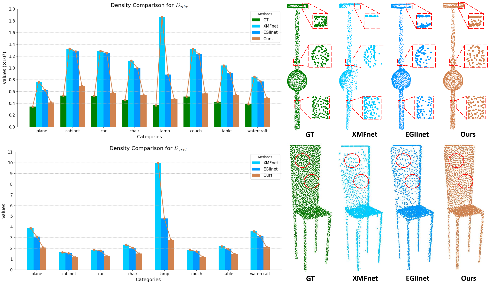
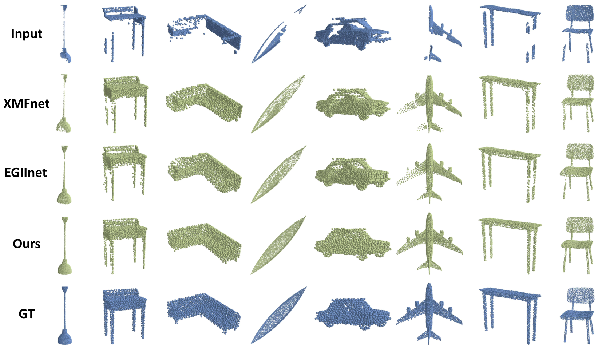

# MAENet: Boosting Accuracy and Evenness in Image-Guided Point Cloud Completion

Official implementation of the paper  
**"MAENet: Boosting Accuracy and Evenness in Image-Guided Point Cloud Completion"** (Information Fusion 2025)  📄 [Paper](https://www.sciencedirect.com/science/article/pii/S1566253525002520) 




---

## 📚 Table of Contents
- [🔧 Installation](#-installation)
- [📦 Dataset Preparation](#-dataset-preparation)
- [🚀 Training](#-training)
- [🧪 Evaluation](#-evaluation)
- [🎯 Pre-trained Models](#-pre-trained-models)
- [📊 Results](#-results)
- [🙏 Acknowledgements](#-acknowledgements)
- [📖 Citation](#-citation)
- [📄 License](#-license)

---

## 🔧 Installation

```bash
conda create -n MAENet python=3.8
conda activate MAENet

# Install PyTorch (choose versions based on CUDA version)
# Example: CUDA 11.1
pip install torch==1.9.1+cu111 torchvision==0.10.1+cu111 torchaudio==0.9.1 -f https://download.pytorch.org/whl/torch_stable.html

# Install additional dependencies
cd Pointnet2_PyTorch
pip install pointnet2_ops_lib/.
sh setup.sh
# If issues arise, consider running setup steps manually.
```

---

## 📦 Dataset Preparation

We follow the dataset setup used in [ViPC](https://github.com/Hydrogenion/ViPC).  
Please refer to the [XMFnet](https://github.com/diegovalsesia/XMFnet) repo for detailed guidance.

### 🔹 Step-by-step:

1. **Download ShapeNetViPC Dataset**  
   - [Dropbox](https://www.dropbox.com/s/271igg35ti93y6z/ShapeNetViPC-Dataset.tar.gz?dl=0)  
   - [Baidu (code: ar8l)](https://pan.baidu.com/s/1NJKPiOsfRsDfYDU_5MH28A)

2. **Extract the dataset**  
   ```bash
   cat ShapeNetViPC-Dataset.tar.gz* | tar zx
   ```

   This will create a folder named `ShapeNetViPC-Dataset` containing:
   - `ShapeNetViPC-Partial`: Partial point clouds
   - `ShapeNetViPC-GT`: Ground-truth complete shapes
   - `ShapeNetViPC-View`: Multi-view RGB images (24 views)

   Metadata for camera views is available in:  
   ```
   /ShapeNetViPC-View/<category>/<object_name>/rendering/rendering_metadata.txt
   ```

---

## 🚀 Training

Training configurations are defined in `config.py`.

To start training:

```bash
python train.py
```

---

## 🧪 Evaluation

To evaluate a trained model (select target category in `config.py`):

```bash
python eval.py
```

---

## 🎯 Pre-trained Models

Download pre-trained weights:  
🔗 [Google Drive](https://drive.google.com/file/d/1Hi2ZBQh2HYHmWHC2OZzexD_TofvbrmXF/view?usp=sharing)

---

## 📊 Results

**Comparison of Mean Chamfer Distance per point ($\text{CD} \times 10^3 \downarrow$)**

| Method            | Modality | Avg   | Airplane | Cabinet | Car   | Chair | Lamp  | Sofa  | Table | Watercraft |
|-------------------|----------|-------|----------|---------|-------|-------|--------|-------|--------|-------------|
| AtlasNet          | P        | 6.062 | 5.032    | 6.414   | 4.868 | 8.161 | 7.182  | 6.023 | 6.561  | 4.261       |
| FoldingNet        | P        | 6.271 | 5.242    | 6.958   | 5.307 | 8.823 | 6.504  | 6.368 | 7.080  | 3.882       |
| PCN               | P        | 5.619 | 4.246    | 6.409   | 4.840 | 7.441 | 6.331  | 5.668 | 6.508  | 3.510       |
| TopNet            | P        | 4.976 | 3.710    | 5.629   | 4.530 | 6.391 | 5.547  | 5.281 | 5.381  | 3.350       |
| PF-Net            | P        | 3.873 | 2.515    | 4.453   | 3.602 | 4.478 | 5.185  | 4.113 | 3.838  | 2.871       |
| MSN               | P        | 3.793 | 2.038    | 5.060   | 4.322 | 4.135 | 4.247  | 4.183 | 3.976  | 2.379       |
| GRNet             | P        | 3.171 | 1.916    | 4.468   | 3.915 | 3.402 | 3.034  | 3.872 | 3.071  | 2.160       |
| PoinTr            | P        | 2.851 | 1.686    | 4.001   | 3.203 | 3.111 | 2.928  | 3.507 | 2.845  | 1.737       |
| PointAttN         | P        | 2.853 | 1.613    | 3.969   | 3.257 | 3.157 | 3.058  | 3.406 | 2.787  | 1.872       |
| SDT               | P        | 4.246 | 3.166    | 4.807   | 3.607 | 5.056 | 6.101  | 4.525 | 3.995  | 2.856       |
| Seedformer        | P        | 2.902 | 1.716    | 4.049   | 3.392 | 3.151 | 3.226  | 3.603 | 2.803  | 1.679       |
| ViPC              | P + I    | 3.308 | 1.760    | 4.558   | 3.183 | 2.476 | 2.867  | 4.481 | 4.990  | 2.197       |
| CSDN              | P + I    | 2.570 | 1.251    | 3.670   | 2.977 | 2.835 | 2.554  | 3.240 | 2.575  | 1.742       |
| XMFnet            | P + I    | 1.443 | 0.572    | 1.980   | 1.754 | 1.403 | 1.810  | 1.702 | 1.386  | 0.945       |
| EGIInet           | P + I    | 1.211 | 0.534    | 1.921   | 1.655 | 1.204 | 0.776  | 1.552 | 1.227  | 0.802       |
| MAENet (Ours)     | P + I    | **1.041** | **0.483** | **1.608** | **1.524** | **1.053** | **0.624** | **1.317** | **1.034** | **0.687** |


**Comparison of Mean F-Score @ 0.001 ($\uparrow$)**

| Method            | Modality | Avg   | Airplane | Cabinet | Car   | Chair | Lamp  | Sofa  | Table | Watercraft |
|-------------------|----------|-------|----------|---------|-------|-------|--------|-------|--------|-------------|
| AtlasNet          | P        | 0.410 | 0.509    | 0.304   | 0.379 | 0.326 | 0.426  | 0.318 | 0.469  | 0.551       |
| FoldingNet        | P        | 0.331 | 0.432    | 0.237   | 0.300 | 0.204 | 0.360  | 0.249 | 0.351  | 0.518       |
| PCN               | P        | 0.407 | 0.578    | 0.270   | 0.331 | 0.323 | 0.456  | 0.293 | 0.431  | 0.577       |
| TopNet            | P        | 0.467 | 0.593    | 0.358   | 0.405 | 0.388 | 0.491  | 0.361 | 0.528  | 0.615       |
| PF-Net            | P        | 0.551 | 0.718    | 0.399   | 0.453 | 0.489 | 0.559  | 0.409 | 0.614  | 0.656       |
| MSN               | P        | 0.578 | 0.798    | 0.378   | 0.380 | 0.562 | 0.652  | 0.410 | 0.615  | 0.708       |
| GRNet             | P        | 0.601 | 0.767    | 0.426   | 0.446 | 0.575 | 0.694  | 0.450 | 0.639  | 0.704       |
| PoinTr            | P        | 0.683 | 0.842    | 0.516   | 0.545 | 0.662 | 0.742  | 0.547 | 0.723  | 0.780       |
| PointAttN         | P        | 0.662 | 0.841    | 0.483   | 0.515 | 0.638 | 0.729  | 0.512 | 0.699  | 0.774       |
| SDT               | P        | 0.473 | 0.636    | 0.291   | 0.363 | 0.398 | 0.442  | 0.307 | 0.574  | 0.602       |
| Seedformer        | P        | 0.688 | 0.835    | 0.551   | 0.544 | 0.668 | 0.777  | 0.555 | 0.716  | 0.786       |
| ViPC              | P + I    | 0.591 | 0.803    | 0.451   | 0.512 | 0.529 | 0.706  | 0.434 | 0.594  | 0.730       |
| CSDN              | P + I    | 0.695 | 0.862    | 0.548   | 0.560 | 0.669 | 0.761  | 0.557 | 0.729  | 0.782       |
| XMFnet            | P + I    | 0.796 | 0.961    | 0.662   | 0.691 | 0.809 | 0.792  | 0.723 | 0.830  | 0.901       |
| EGIInet           | P + I    | 0.836 | 0.969    | 0.693   | 0.723 | 0.847 | 0.919  | 0.756 | 0.857  | 0.927       |
| MAENet (Ours)     | P + I    | **0.873** | **0.981** | **0.754** | **0.756** | **0.885** | **0.945** | **0.818** | **0.895** | **0.951** |



---

## 🙏 Acknowledgements

This work is built heavily upon [XMFnet](https://github.com/diegovalsesia/XMFnet)

---

## 📖 Citation

If you find our work helpful, please cite:

```
@article{liu2025maenet,
  title={MAENet: Boost image-guided point cloud completion more accurate and even},
  author={Liu, Moyun and Yang, Ziheng and Chen, Bing and Chen, Youping and Xie, Jingming and Yao, Lei and Chau, Lap-Pui and Du, Jiawei and Zhou, Joey Tianyi},
  journal={Information Fusion},
  pages={103179},
  year={2025},
  publisher={Elsevier}
}
```
---

## 📄 License

This repository is licensed under the MIT License. See [LICENSE](LICENSE) for details.
